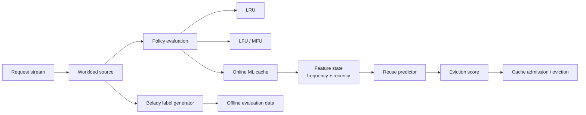
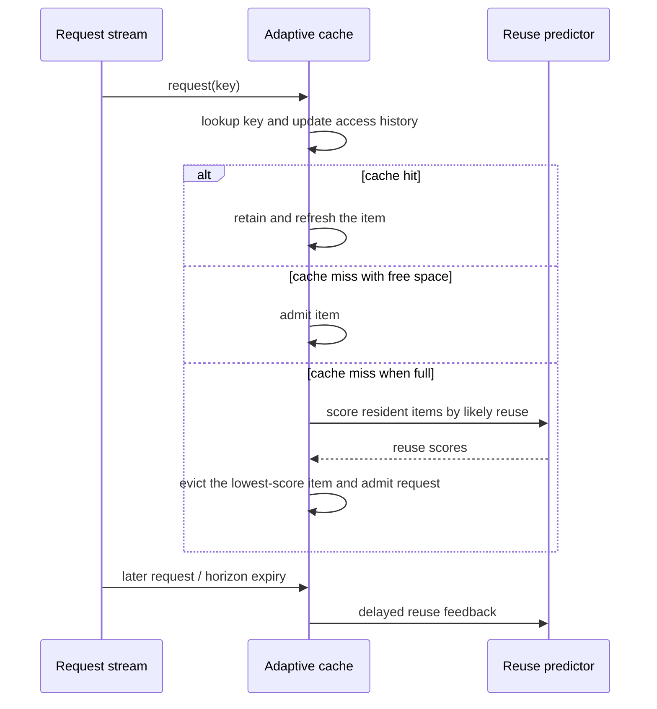

# Intelligent Cache Replacement Engine
<p align="center">
  
</p>
An adaptive cache-replacement engine that learns which objects are likely to be reused, then uses that signal when cache space is needed. The project compares conventional replacement policies with an online, reuse-aware policy under repeatable skewed workloads.

## Why this project

I built this project to understand a practical systems question: a cache is fast only when it keeps the *right* data. Traditional policies are strong baselines, but a request stream can change over time. I wanted to explore whether a lightweight learner can use recent access behaviour to make better eviction choices without relying on future knowledge.

The engine treats Belady's optimal policy as an offline reference point. It is useful for evaluating ideas, but it is not used for live eviction because it requires knowing future requests.

## Architecture



### Request path



## Core concepts

### Cache policies

| Policy | Decision principle |
| --- | --- |
| LRU | Removes the item not used for the longest time. |
| LFU | Removes the least frequently used item. |
| MFU | Removes the most frequently used item; included as a contrast baseline. |
| Online ML | Estimates near-future reuse from access frequency and recency, then removes the lowest-scoring resident item. |

### Reuse-aware learning

The adaptive policy does not pretend that a cache hit is the same thing as a good prediction. Instead, it receives delayed feedback:

- A request becomes a positive example if the same key is requested again within a bounded reuse horizon.
- It becomes a negative example if that horizon expires without a reuse.
- Frequency and time since the previous request form the reuse signal.

This keeps the learning objective aligned with eviction: retain objects that are more likely to be needed again soon.

### Offline reference data

The generator can create a request trace and label it with Belady's optimal policy. These labels describe the best possible result for a trace with complete future knowledge. They are for analysis and optional offline experiments, not for the runtime cache.

## Components

| Component | Responsibility |
| --- | --- |
| Native cache engine | Runs policy simulations, online reuse learning, and benchmark reporting. |
| Workload generator | Produces deterministic Zipfian request streams for repeatable tests. |
| Belady labeller | Produces offline reference labels from a complete trace. |
| Benchmark runner | Sends the same stream to every policy and reports hit rates. |
| Optional Python experiments | Retained for exploratory sklearn/boosting comparisons; not required by the native runtime. |

## How to use

### Fast native run

```bash
./script.sh
```

This builds the engine, generates a labelled workload, runs the native benchmark, and executes self-tests.

### Build manually

```bash
make
make test
```

### Run a benchmark

```bash
./cache_engine benchmark \
  --requests 100000 \
  --items 1000 \
  --capacity 100 \
  --skew 1.2 \
  --seed 42
```

`--seed` makes the workload repeatable, so policy results can be compared fairly.

### Create Belady-labelled data

```bash
./cache_engine generate \
  --requests 100000 \
  --items 1000 \
  --capacity 100 \
  --skew 1.2 \
  --seed 42 \
  --output data/labeled_requests.csv
```

### Optional Python exploration

```bash
./script.sh --python
```

This installs the optional Python dependencies and runs the earlier experimental models. Their classification accuracy should not be compared directly with cache hit rate: a high classification score can still produce a weak eviction policy when cache-hit labels are imbalanced. Use the native benchmark as the primary runtime result.

## Interpreting results

The benchmark reports hit rate, which is the meaningful cache metric:

```text
hit rate = cache hits / total requests
```

Compare policies only on the same request count, item count, capacity, skew, and seed. A policy that wins on one workload is not automatically best on every workload; cache performance depends on locality, workload shifts, and available capacity.

## Tech stack

- C++17 for the native engine and online adaptive cache
- Standard C++ library data structures and random distributions
- Make and CMake build configuration
- Python plus sklearn/boosting libraries only for optional offline experiments

## License

MIT
